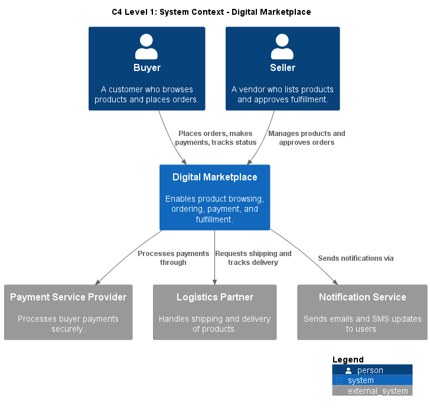
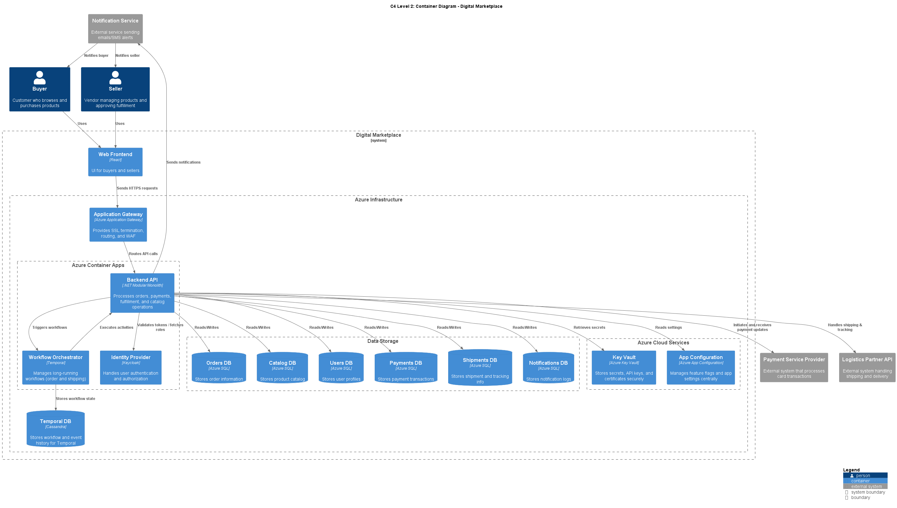
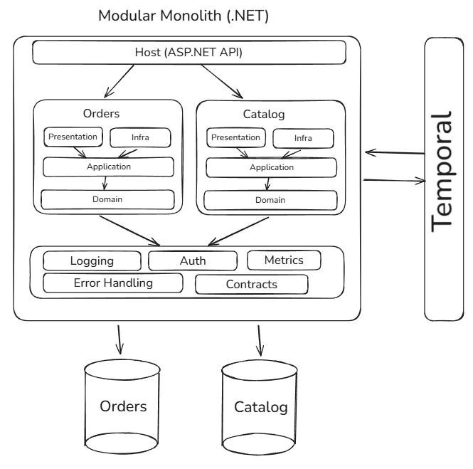
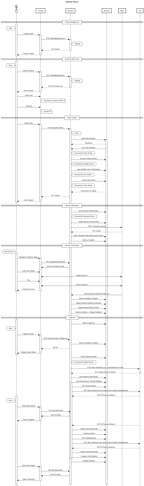

# Scalable Order Processing System for a Digital Marketplace <!-- omit from toc -->

## Table of Contents <!-- omit from toc -->

- [Overview](#overview)
- [Architecture \& Design](#architecture--design)
  - [Architecture Choice](#architecture-choice)
  - [Evolution Plan](#evolution-plan)
  - [Architecture Diagrams](#architecture-diagrams)
- [C1: System Context Diagram](#c1-system-context-diagram)
- [C2: Container Diagram](#c2-container-diagram)
  - [Storage Strategy](#storage-strategy)
  - [Key Technologies](#key-technologies)
- [Sequence Diagram: Order Processing, Payments \& Fulfillment](#sequence-diagram-order-processing-payments--fulfillment)
- [Deployment Strategy](#deployment-strategy)
  - [Key Principles](#key-principles)
  - [Iteration 1 (MVP)](#iteration-1-mvp)
  - [Networking: Hub-Spoke Model](#networking-hub-spoke-model)
  - [Security \& Compliance](#security--compliance)
 

## Overview

This repository presents a technical solution for designing and implementing a [**scalable**](./BUSINESS_CONTEXT.md#scalable), [**resilient**](./BUSINESS_CONTEXT.md#resilient), and [**efficient**](./BUSINESS_CONTEXT.md#cost-effective) order processing system tailored to the needs of a rapidly growing [**digital marketplace**](./BUSINESS_CONTEXT.md#digital-marketplace). The solution emphasizes [**simplicity**](./BUSINESS_CONTEXT.md#maintainable), [**scalability**](./BUSINESS_CONTEXT.md#scalable), and [**operational efficiency**](./BUSINESS_CONTEXT.md#cost-effective), suitable for an organization with limited internal technical expertise.

> 🔎 For business context, glossary and profile, please refer to the [Business Context](./BUSINESS_CONTEXT.md) document.

---

## Architecture & Design

### Architecture Choice

| Option               | Pros                                                                 | Cons                                                            |
|----------------------|----------------------------------------------------------------------|-----------------------------------------------------------------|
| **Modular Monolith** | Easier to deploy and manage. Shared memory, fewer network hops.      | Less granular scaling. Requires internal discipline.            |
| Microservices        | Independent scaling, decoupled deployment.                          | Higher operational complexity, distributed transactions.          |
| Serverless           | Auto-scaling, no infra management, pay per use.                    | Cold starts, vendor lock-in, complex orchestration for workflows.|

>**Iterative Architecture Chosen:**  
A **Modular Monolith** enhanced with **Temporal-based task orchestration** for managing complex workflows and ensuring durability, combined with asynchronous communication between internal modules designed for further migration to **Microservice** architecture.

---

### Evolution Plan

**Iteration 1 (Current):**
- **Architecture:** Modular Monolith
- **Deployment:** Containerized (.NET app in Docker) and deployed to **Azure Container Apps** for simplicity.
- **Focus:** Rapid delivery, low operational overhead, and easy horizontal scaling for initial growth.
- **Additional Goal:** Implement **monitoring and observability** (metrics, logs, traces, health checks) to establish visibility into application behavior.

**Between Iteration 1 and Iteration 2:**
- Gather operational metrics on **traffic volume**, **database query performance**, and **workflow latency** using built-in telemetry and custom instrumentation.
- Use collected data to determine **system bottlenecks** and identify **modular boundaries for decomposition** into microservices.
- **Enhance the observability stack** by implementing:
  - **Azure Application Insights** for application performance monitoring, request tracing, and live metrics (ideal for Azure-hosted apps).
  - **OpenTelemetry** instrumentation in .NET services and Temporal workflows for standardized metrics and traces.
  - **Dashboards and Alerts** in **Azure Monitor** for critical KPIs (order throughput, payment success rate, workflow retry count).

**Iteration 2 (Future):**
- **Architecture:** Transition to **Microservices** for independent scaling of critical components (e.g., Order Service, Payment Service, Fulfillment Service).
- **Deployment:** Managed via **Azure Kubernetes Service (AKS)** for advanced orchestration, service discovery, autoscaling, and fault isolation.
- **Triggers for Migration:**
  - 5x user and order growth (or more).
  - Measurable performance bottlenecks in the monolith.
  - Business need for independent deployments and scaling.

---

### Architecture Diagrams

## C1: System Context Diagram

## C2: Container Diagram

---

View the **Modular Monolith Architecture Schema** here:
[Excalidraw Diagram](https://excalidraw.com/#json=Qc71GkGgcANOaw02vsBFh,PA7T5ECKcfV-3X9_mJt7iA)  

---
### Storage Strategy

- **Relational Database (MSSQL)** for transactional consistency (orders, payments).
- **Hybrid Approach within MSSQL:** Use [JSON columns](https://learn.microsoft.com/en-us/sql/t-sql/data-types/json-data-type) for semi-structured data generated by internal module communication, enabling flexible queries without introducing an additional NoSQL system.
- **[Event Store](https://docs.temporal.io/workflow-execution/event)** for workflow traceability and system auditability stored in [Cassandra](https://docs.temporal.io/self-hosted-guide/visibility#cassandra).
- **Optional NoSQL** for read optimization (e.g., order summaries).

---

### Key Technologies

- **.NET 8/10** for building modular monolith.
- **Temporal.io** for workflow orchestration and durable execution of order, payment, and fulfillment processes.
- **Azure DevOps** for:
  - **Work item management** (epics, features, tasks)
  - **Project planning** (Agile boards, sprints)
  - **Source code repository** (Git repos)
  - **CI/CD pipelines** for build, testing, deployment, and release
- **PostgreSQL or MSSQL Server** as the primary relational database for transactional consistency.
- **Entity Framework Core (EF Core)** as the ORM for database access, enabling LINQ queries, migrations, and JSON column handling for hybrid storage.
- **Redis** for caching frequently accessed data and buffering asynchronous tasks. (not recommended at first)
- **Docker** for containerized environments.

---

## Sequence Diagram: Order Processing, Payments & Fulfillment

This sequence diagram illustrates the **core order lifecycle**:  

🔗 [View & Edit Diagram Online](https://sequencediagram.org/index.html#initialData=C4S2BsFMAIFkEMBOBrSxoAVzwMaQFD67AD2i0AqgM6SL4AOSoOIjAdugGKIkeRsATBkxAt26AEK5kAUUHDEzVvA7QAKpAC29MvHAKl46AGVgiVgUaLRy1RQzHCVRnkL4AvO8w8BAVxzoCGzwAOZa-OiehMQgAG7wwDDUtPiIAEYkAB7QUABm6CS5lDSIAFwmkOBQdMnkALQAfNDcvImC5QDCiJAJMBg+-sBEAXG9zTx88i2TAtCN0FI4su2YAPLGatAA9PD0IFs4CXokIVRb9AMBVMOg8YkL0nJC6VnQ5iEAFgVFi8sCpR0juATtdfk85vNpm1-tAAEwABgAjNAuj1EkIBD0RncYGCphNoRCmrVyv0SH4Aijur0MVjbmMofxaTEcfB8rRiikPF4JDwAO40aAAMmgAEEBLNSCimNAoiyxrVUhlsnlvpyygtfABPFK1OZNRkrYw9RA4D7ecmDa7y+6GoR2-UPJZPcoAcRkmx2ewOQJB50uwGt2LGeOeyreIE+atDAN9p3woaJ41aTPKCPh0FWAGloAAKMkU9AAGRAVGAAEp8JibbjHviU4IkySTB8SHyLYXrtXg7aCUzCHrIX2VuLJSRpYp8GwSPd3l9oIVkzNOjKy2RILMQGwKlQqCBeHnYAA1DCIyv4WqNO0Aj6QJYkXxDaezyPzxfXlG3++PwieTOITFyFRBJ923KILxKR0P2A+5VgAlIayXaF8AdeYYzWDZoF2fYyEAs5cNoIN6XuUMlVeOdozrf44LwhMqMdDRtF0cBylMGUaI5AB1MhkFyYE+RuUZ7kYnRED0OjnUbAAeOo6nULRRL0cpuJQPi2wASSERMZPkpixJY6AACVfG3DjyBU3j+LI7IKIXH4qNKGRMjvR8NwWLV-zw6ALJSRN5hE5jykMu9IDiPoAyoMVsTALVrIjKM7KdP5HOcnBXNmCQPMBYBjlObyeN8+j-IUwKTHgWIYAstT2z1MlchAKAotuGK4tsxcYyclz0Xc9VIp8ug-KaAL9M6alYPg8hRWi4BYpeGzX0oyT-k6tLusyzzCPylBCqW6AZLk4alOgGQkHADzguAXxEG3WIQHgSh6AEXoUOHWZ9qSl04SRKk0Q3CCOXej8zJ+mkqzpISYDtMGazZRJyEVblMHgLVNAiaB1LYMA7vAEAAC8QIPcDQ0aQ6WOMcq+mR1HVAAETQeAGsiqbmpm1qFsSjrUvSnqMCpiI+oKgaqJJkqRpgymUbRjG2kDJq4ha4mGlMcx6EgUoMHWT1YkRc4+Y4AB9LcZdBej3uViw02+8WtKKobRaO8mKvUMS2CoGIDxpo48xwHGIn1mgcG6Cs5du1nFdJ0pOIZrgyBRXgBCx3hfy8XnJdUDpeHqxBNAJsD3GicNVUSkkADlIEydAABYAA5oAACQfRAiIh9V-sQK9XtKEvysjMY1HHVPqfQNiwkEnEkP7O1Ghjd1Nmw3W08DBeh+uO0ZJjdNMxzXM1Bdt2Rg9o5K0HA1O+OvggKQWY6ZyxmXobN75nN1XyjrlQBEawEAPRthchINuO4P3Vsje+Mw9pPzMBbC0eBdxI0Xm3cBckPyDzRsYfwMCuzg3HlDbsxEejsnhiUQgz8YBoQchURsKD06ZxANnXO3lIBpFbCQZAEk-gMXtgZYKVBfCoy2pZNs0Bbr3WMJGYI+hBq6UUgZURIRxH8OqnmKh6AM6-1oajAQlZSbgI+isCgj0xjKJMDlS6TNpqxW0TpdCqjQBsF8JVHiijABJhN4SAVhIa+HAPVKoQ9k7NE8d48AQ9ZT5zHgqIh4dOGR2js0WOop6AXBIPEfQc0ciQHyMXEorFKjVAAQ0a88TEkVUimZMJvYH6gOhNPByGtMLzwIk3LYDSzilBAAILYAASXYRSCCSIjkZSAPC+FVX4kIu6JgxHiTXrJDe8IMzZjbjJa8NNSz0GwFlK63RVBsVMdDHskNXp7LwbDDkipLFyWsWNGAxgPisGCczeWrNUltXsktFKXU3LrRuawPYbAQj8J2uw+Y9hjCkk1tAL4wB6BUFKFsJpbAcZsDQCQEg4AqAADpfDQvRTgEgmgvT7CoLc+gK8tjay2ES1gZSkgOAvA4JM6EETImtnmb5JK0Y3wZmiysuCW4grYeCYqekHYUxbHcjlXsHmh1ipE4VLFjLbg6Lc8Asw2XBN3tILc-yRltmpbom2S0RZytKAq52mq-khwVsLBoILSizwhcAKFMK4W8ERci1FGKsUYtxfi+eZhpBkp1piW+aKtilH9UsLVJdeFpEBU8fatrN7ZiUdIUI1yTG+BoFQSsiFFSpKLouZsEhtS6hKIA5cSq7zIA2uQHZma9VQyng0GeHosLemaU0iaq9Xrrwckm7eZlj4lCWZ3YG6lIpst+SEI5LcoahgTQ4Uo-aU1LDTcYhImbBmVlldI0o+inrjUAtAT2OVLVh2tRHGxW57FikimXASO7Aqmo1ZGi1UqrWGptYu+1kLoWwvhW60gHrMXYp9QSrYEbkCBq2MGrlLTINRpjXGwQC7QXLvzKmsI67TFboFYII1u791jGBie+677z2fsvXitZaAYBKoarMHVAleWsgIfqvDswhW7rjtoKA9wmN5OvJWpYNbsP1sQo2161S3n2vqV2zttFpmzPmQOiaQ7aAjqAWOyKdMcYVW6MyfZE95BAA)

---

## Deployment Strategy

### Key Principles
- **Infrastructure as Code (IaC):**  
  Adopt **Terraform** (or **Terragrunt** for managing environments and DRY configurations) to define, provision, and manage infrastructure in a reproducible and auditable manner.

- **Modular Design for Infrastructure:**  
  Separate modules for networking, compute, databases, and monitoring. This improves maintainability and simplifies migration from MVP to production-scale environments.

- **Governance & Resource Lifecycle Management:**  
  - Enforce a **tagging strategy** for all IaC-deployed resources (e.g., `Deployment=IaC`).
  - Configure **Azure Policy** to **audit or deny** manually created resources without required tags.
  - Implement an **auto-cleanup policy** via **Azure Automation** or **Logic Apps** to:
    - Identify resources not deployed through automation (missing `Deployment=IaC` tag).
    - Remove these resources if they remain unused for more than **7 days**.
  - Purpose: Ensure cost control, prevent resource sprawl, and enforce consistent governance.

---

### Iteration 1 (MVP) 
- **Hosting Choice:**  
  Deploy the modular monolith in **Azure Container Apps** for simplicity and cost efficiency. Support containerized .NET applications and provide autoscaling.
  
- **CI/CD Pipeline:**  
  Implement a **basic yet robust Azure DevOps pipeline** with:
  - **CI:**  
    - Restore NuGet packages  
    - Build the solution  
    - Run unit tests with coverage and publish test results  
  - **CD:**  
    - Build Docker image and push to **Azure Container Registry (ACR)**  
    - Deploy to Azure Container Apps  
  - **Observability:** Enable **Application Insights** for monitoring logs, metrics, and failures from day one.

- **Testing Strategy:**  
  Primarily **manual testing** during MVP. Automated UI or end-to-end tests can be introduced later when core workflows stabilize.

---

### Networking: Hub-Spoke Model  
- **Architecture:**  
  - **Hub VNet:**  
    - Hosts shared services like **Azure Firewall**, **VPN Gateway**, **ExpressRoute**, and **Azure Bastion**.  
    - Acts as the central governance layer for security and connectivity to on-prem or other Azure regions.  
  - **Spoke VNets:**  
    - Each environment (e.g., **Dev**, **Test**, **Prod**) runs in its own spoke.  
    - MVP Modular Monolith, Key Vault, DBs → deployed **per spoke**.   

- **Benefits:**  
  - **Scalability:** Easy to add new environments without redesigning the entire network.  
  - **Security:** Centralized security and routing control.  
  - **Cost Control:** Shared services (App Gateway, Monitoring, VPN) are consolidated in the Hub.

---

### Security & Compliance  
- **Secrets Management:** Store secrets in **Azure Key Vault** (integrated with App Service, AKS, and Terraform).
- **Private Endpoints:** Use **Private Links** for ACR, databases, and Key Vault through the Hub.
- **Role-Based Access Control (RBAC):** Configure in Azure AD and Azure DevOps for least-privilege deployment permissions.

---

